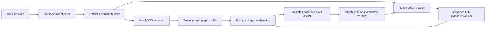

# Casework — TigerGraph Agentic Fraud Investigation

A local investigation console for the Hacker House Goa benchmark. Casework combines TigerGraph graph traversal, native vector search, official TigerGraph MCP, a local language model, and deterministic approval rules.

## What it does

- Investigates a supplied trigger using customer history, explicitly attributed card transactions, device neighbors and historical cases.
- Detects testing sequences, unusual online activity, new-device signals, out-of-region activity, mixed-channel takeover hypotheses and coordinated new-device/proxy motifs.
- Records uncertainty and explicit simulated verification responses; recommendations never execute banking operations.
- Produces the required case JSON, initial/final action routes and policy-required SAR draft.
- Saves the case and versioned investigation memory to TigerGraph. Future investigations retrieve earlier generated memory with its simulation disclaimer.
- Shows evidence, graph relationships, actions, SAR drafts and execution traces in a browser.

Probabilities are transparent heuristics, not calibrated estimates. Pattern hypotheses are not confirmed outcomes. No hidden benchmark labels or public Kaggle outcomes are used.

## Run locally

Requires Python 3.11+, TigerGraph Savanna with the supplied dataset loaded, and Ollama with `llama3.2:3b` and `nomic-embed-text`.

```powershell
python -m pip install -r requirements.txt
Copy-Item .env.example .env
# Fill in your own TigerGraph host, graph and secret.
python -m scripts.deploy_agent
python -m scripts.deploy_memory
python -m scripts.agent.generate_cases
python -m uvicorn ui.server:app --host 127.0.0.1 --port 8000
```

Open http://127.0.0.1:8000. On an existing prepared graph, skip deployment and ingestion.
For a fresh graph, follow [data loading](docs/DATA_LOADING.md) and deploy [the schema](tigergraph/schema/schema.gsql) first. Put the organizer-provided files in `data/raw/`; the large dataset and credentials are excluded from Git.

### Explicit simulation

```powershell
python -m scripts.agent.generate_cases --case HHG-010 --response denied
python -m scripts.agent.generate_cases --case HHG-010 --response confirmed
python -m scripts.agent.generate_cases --case HHG-010 --response no_reply_24h
```

These are assumptions for the challenge, not received customer replies. Rerunning a case updates its current answer and appends a versioned memory record. Run the default benchmark again to restore pending-response answers.

## Architecture



The model chooses a retrieval query and an evidence request and reviews retrieved evidence. It cannot execute arbitrary GSQL or financial actions. Policy code controls action routing. Original historical labels remain separate from generated memory.

## Verification and deliverables

```powershell
python -m pytest -q -p no:cacheprovider
python -m scripts.audit_submission
```

- [20 answer files](cases/)
- [Technical blog](docs/BLOG_POST.md)
- [Submission audit](docs/SUBMISSION_AUDIT.md)
- [Model configuration](docs/MODEL_CONFIGURATION.md)
- [Demo materials](docs/demo/)

Execution results and publication status should be checked against the latest audit. Unit tests establish specific behavior, not hidden-label accuracy.

## Important modeling limits

The dataset does not give a card ID for every transaction. Only explicit historical and trigger anchors form card-transaction edges. Customer history is not silently relabeled as card history. Generic device profiles and email domains are not unique people or merchants. Merchant identity and settlement status are absent, so recurring-merchant and cleared-purchase rules require additional verified evidence.

Savanna auto-start and auto-suspend should remain enabled. Credentials stay in `.env`; the console binds to loopback and should not be exposed publicly without authentication.

## Attribution

IEEE-CIS/Vesta dataset with challenge additions by TigerGraph. See the organizer-provided README for the authoritative benchmark and policy. Regulatory context is attributed in retrieved documents and the blog.
