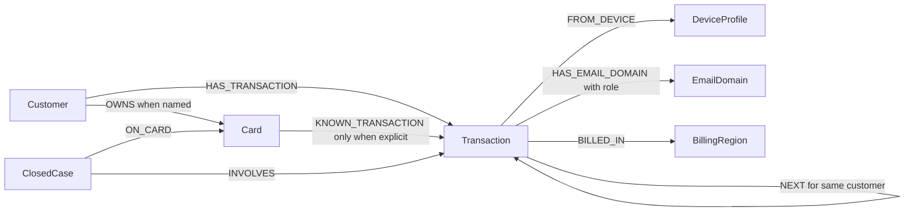

# Graph model based on validated CSVs

The five official files were validated locally: 590,742 transactions, 144,432 identity records, 5,565 closed cases, and 20 benchmark triggers. One dataset limitation changes the README's suggested graph: `transactions.csv` has no `card_id`. `card1` is shared by all transactions observed for each sampled customer even when the benchmark names a `K2` card. It cannot safely identify `K1` versus `K2`. The graph therefore links every transaction to its known customer, and adds `Card -> Transaction` edges **only** for transaction/card pairs explicitly named by the case pack or closed cases.

`Customer` uses `customer_id`. `Transaction` uses `TransactionID`; preserve the original string even if it looks numeric. `DeviceProfile` is a normalized tuple of `DeviceInfo`, `id_30` (OS), `id_31` (browser), and `id_33` (screen), preserving the original values. `EmailDomain` uses both `P_emaildomain` and `R_emaildomain`; an edge's `email_role` is `purchaser`, `recipient`, or `purchaser|recipient` when they match. `BillingRegion` uses `addr1` as an anonymized code, not a geographic name. `ClosedCase` uses `case_id` and keeps analyst notes and outcome. The benchmark case should become a separate case vertex only when an actual investigation writes it to TigerGraph.

Historical `txn_ids` provide 14,955 explicit transaction/card anchors with no conflicting labels. The 20 benchmark flagged transactions supply another 20 anchors. They do **not** identify every transaction on a card, so graph queries must distinguish customer history from proven card history. Card testing on unanchored transactions needs a customer-level candidate sequence, then cautious assessment or more evidence.

Do not create a merchant vertex: the README does not document a merchant ID. Do not treat a shared billing region alone as proof of fraud.
